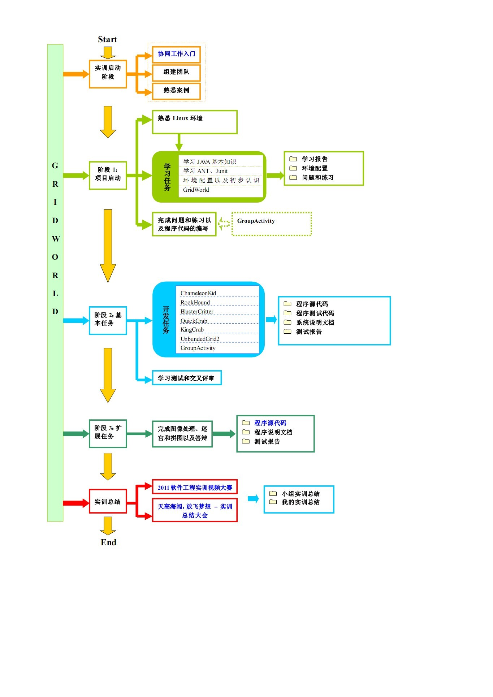
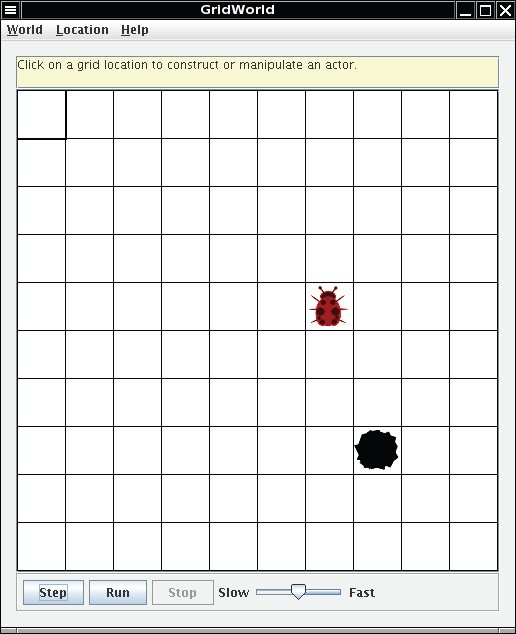

# GridWorld

* TOC
{:toc}

----------

## 简介

GridWorld案例提供了一个图形化环境用于可视化对象在二维网格中的交互。在这个案例中，你将设计和制造各种Actor的对象，将它们添加到一个网格中，并且根据一定的规则决定Actor的行为。此外我们还增加了三个扩展任务，ImageReader、N-Puzzle（华容道）和MazeBug（迷宫）。ImageReader实验要求参训学生利用本实验软装置，实现一个利用二进制流读取Bitmap图像，并且能够进行简单地处理和保存的软件；N-Puzzle实验要求参训学生利用广度优先搜索算法和启发式搜索算法完成重拼图游戏；MazeBug实验要参训学生采用深度优先搜索算法就可以走出迷宫。此项目要求参训学生在短时间内自学新的程序设计语言和相关工具，可以训练参训学生的快速学习的能力。通过此项目实训能让参训学生掌握在**Linux环境下进行代码编写、程序调试和测试**的基本知识，并且掌握使用JDK进行**Java程序设计，用Ant进行程序编译，部署和测试**，以及掌握**单元测试**的基本知识，能使用**JUnit编写测试用例**。另外，通过学习使用**Sonar来规范自己的代码风格，找出代码中潜在的bug**，让自己能写出良好的代码。同时扩展任务可以锻炼参训学生**图像处理能力**和学习、理解、应用**深度优先搜索算法**，**广度优先搜索算法**的能力。

----------

### 目标
本项目将提升和培养参训学生在下述领域的素养和技能：快速学习（fast learning），Linux环境编程、Java程序设计、Ant程序编译、单元测试、团队协作、集体学习。

### 过程
**实训过程**：实训划分为3个阶段，每个阶段参训学生按照案例定义好的步骤参加培训，并完成给定的任务。参见实训流程图。

### 角色
**指导老师**与负责**TA**：统筹所有使用本案例的实训软件项目，定义项目，控制阶段进度，技术指导，并组织提供资源。
**实训生**：**单人独立**实施实训项目。

----------

## 阶段划分

 1. [第一阶段](./Stage1)：项目启动(04.09-04.16)
    - 熟悉Linux 环境。
    - 学习Java基本知识，以及Ant，Junit 的入门。
    - 环境配置以及初步认识GridWorld。

 2. [第二阶段](./Stage2)：基本任务(04.16-04.23)
    - 进一步了解 GridWorld。
    - 掌握 Linux 环境下代码编写、程序调试，编码规范。
    - 掌握单元测试

 3. [第三阶段](./Stage3)：拓展任务(04.23-05.08)
    - 深入了解 GridWorld，理解 GridWorld 使用的数据结构，分析运行效率。
    - 进一步进行简单项目实践及文档的编写。
    - 完成三个扩展内容。

----------

## 技能集

### Linux环境开发技能

| 技能 | 工具 | 范围 | 实训前要求 | 实训后期望 |
| :----: | :----: | :----: | :----: | :----: |
| Ant | 纸、笔，VIM | 所有人 | 无 | 能使用Ant进行程序编译，部署和测试 |
| Junit | Eclipse | 所有人 | 无 | 能编写有效的测试用例，使用JUnit进行简单的单元测试 |
| Linux常用命令 | Linux操作系统 | 所有人 | 了解程序的安装方法，以及常用的文件操作命令和shell的基本使用 | 熟练使用Linux常用命令 |

### 算法知识

| 技能 | 工具 | 范围 | 实训前要求 | 实训后期望 |
| :----: | :----: | :----: | :----: | :----: |
| 广度优先搜索（BFS） | 纸、笔、Jigsaw类 | \>1 | 无 | 深刻理解广度优先搜索并能熟练应用 |
| 启发式搜索 | 纸、笔、Jigsaw类 | \>1 | 无 | 深刻理解广度优先搜索并能熟练应用 |
| 深度优先搜索（DFS） | MazeBug | \>1 | 无 | 深刻理解深度优先搜寻并能熟练应用 |

### 图像处理

| 技能 | 工具 | 范围 | 实训前要求 | 实训后期望 |
| :----: | :----: | :----: | :----: | :----: |
| 图像读取 | ImageReader | \>1 | 无 | 了解Bitmap 文件结构，实现一个利用二进制流读取Bitmap图像 |
| 图像简单处理 | ImageReader | \>1 | 无 | 能进行简单的图像处理 |

----------

## 交付制品

### 工程制品

 1.  学习报告：vi,java,ant 和 junit 学习报告
 2.  练习：[Part1](./Stage1--Part1),[Part2](./Stage2--Part2),[Part3](./Stage2--Part3),[Part4](./Stage2--Part4),[Part5](./Stage2--Part5) 的问题与练习
 3.  用户文档：[图像处理](./Stage3--ImageProcessing)部分的文档、[迷宫](./Stage3--MazeBug)部分的文档、[拼图](./Stage3--NPuzzle)部分的文档。
 4.  代码：[图像处理](./Stage3--ImageProcessing)部分的代码、[迷宫](./Stage3--MazeBug)部分的代码、[拼图](./Stage3--NPuzzle)部分的代码。

### 系统样例

系统运行截图

