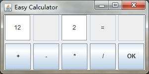

## Java小程序完成要求

* TOC
{:toc}

----------

### 内容

编写一个Java小程序：功能就是简单的计算器，如下图。参考内容可阅读Java的组件GUI设计部分以及基础Java知识。

### 要求

 1. 当点击含有加号的按钮时，则第一排第二个按钮的文本变为加号；
 2. 当点击“OK”按钮时，将算出12+2的结果并在第一排最后一个按钮显示；
 3. 减号，乘号，除号的功能类似。其中，数字可以自己输入，也可以固定不变。

注：样式不一定要与上图相同，完成上述几点要求即可。如果有能力和时间，可以设计出更好更完善的计算器。

