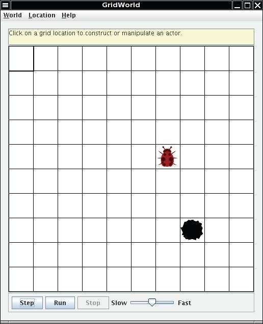
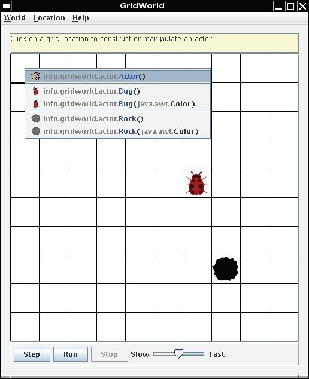
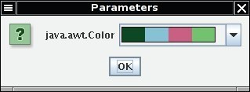
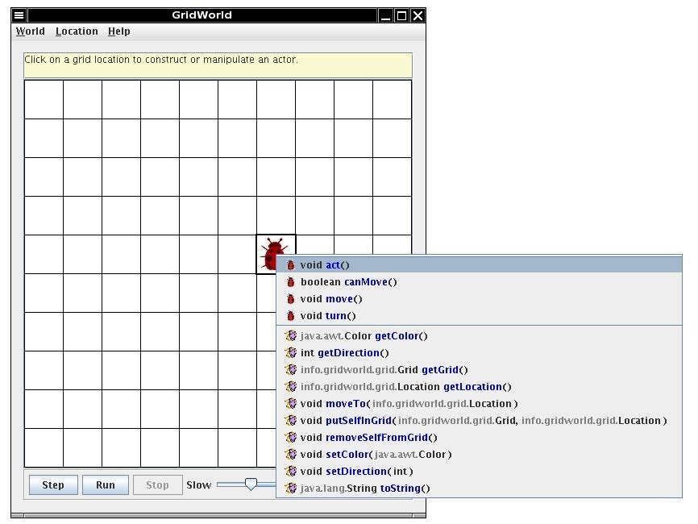
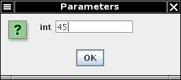

# Part1：Observing and Experimenting with GridWorld

* TOC
{:toc}

---

## Step1：Running the Demo

Once the code is installed, simply compile and run the BugRunner.java application supplied with the case study. The GridWorld GUI will show a grid containing two actors, a "bug" and a "rock."Clicking on the **Step** button runs one step, making each actor act once. Clicking on the **Run** button carries out a series of steps until etween steps during a run can be adjusted with the slider. Try it!

Clicking on an empty cell in the grid displays a drop-down menu that shows the constructors for different actor types.

The menu lists constructors for the classes of all objects that have ever been placed in the grid.Selecting one of these constructors places an instance of that type in the grid. If the constructor has parameters, a dialog window appears, requesting parameter values. For example, after selecting the constructor `info.gridworld.actor.Bug(java.awt.Color)`,the following dialog window appears. Clicking in the color bar produces a drop-down menu from which to choose a color.

What's Happening?

The grid uses directions as on a map: north is up on the screen, east is to the right, south is down, west is to the left. The diagonal directions are northeast, southeast, southwest, and northwest.

One attribute of the bug is its direction (indicated by its antennae). Initially, the bug faces north.Make a bug, take several steps and observe its behavior. Then add more rocks and bugs by clicking on empty cells and selecting the actors of your choice. Answer the following questions based on your observations using the **Step** and **Run** buttons.

### **Answer the following questions on Matrix**

**Set 1**

 01. Does the bug always move to a new location? Explain.
 02. In which direction does the bug move?
 03. What does the bug do if it does not move?
 04. What does a bug leave behind when it moves?
 05. What happens when the bug is at an edge of the grid? (Consider whether the bug is facing the edge as well as whether the bug is facing some other direction when answering this question.)
 06. What happens when a bug has a rock in the location immediately in front of it?
 07. Does a flower move?
 08. What behavior does a flower have?
 09. Does a rock move or have any other behavior?
 10. Can more than one actor (bug, flower, rock) be in the same location in the grid at the same time?

----------

## Step2：Exploring Actor State and Behavior

When you click on a cell containing an actor (bug, flower, or rock), a drop-down menu displays the methods that you can invoke on the actor. The methods that appear above the separator line are specified by the class that defines this actor; those that appear below the line are the methods inherited from the `Actor` class.

Experiment with the different methods to see how they work. Accessor methods will have their results displayed in a dialog window. Modifier methods will cause an appropriate change in the display of the actor in the grid. If parameters are needed for a method, you provide them through a dialog window such as the following.

If you select one of the methods in the menu, it will be invoked for this actor. As an example, click on a bug to see the menu of methods. Now observe what happens when you select the `void setDirection(int)` method. The bug will change its direction to the angle that you supply. Try selecting some of the other methods. What about the act method? If you invoked that method, the actor will behave as if you had clicked on the **Step** button, but no other actors will do anything. A bug will move forward or turn to the right, a flower's color will darken, and a rock will do nothing. The **Step** button simply causes the act method to be invoked on all actors in the grid.

### **Answer the following questions on Matrix**

By clicking on a cell containing a bug, flower, or rock, do the following.

 1. Test the setDirection method with the following inputs and complete the table, giving the compass direction each input represents.

    | Degrees | Compass Direction |
    | :----: | :----: |
    | 0 | North |
    | 45 |  |
    | 90 |  |
    | 135 |  |
    | 180 |  |
    | 225 |  |
    | 270 |  |
    | 315 |  |
    | 360 |  |

 2. Move a bug to a different location using the moveTo method. In which directions can you move it? How far can you move it? What happens if you try to move the bug outside the grid?
 3. Change the color of a bug, a flower, and a rock. Which method did you use?
 4. Move a rock on top of a bug and then move the rock again. What happened to the bug?

----------

## GUI Summary

| **Mouse Action** | **Keyboard Shortcut** | **Result** |
| :----: | :----: | :----: |
| Click on an empty location | Select empty location with cursor keys and press the **Enter** key | Shows the constructor menu |
| Click on an occupied location | Select occupied location with cursor keys and press the **Enter** key | Shows the method menu |
| Select the **Location** -\> **Delete** menu item | Press the **Delete** key | Removes the occupant in the currently selected location from the grid |
| Click on the **Step** button |  | Calls act on each actor |
| Click on the **Run** button |  | Starts run mode (in run mode, the action of the **Step** button is carried out repeatedly) |
| Click on the **Stop** button |  | Stops run mode |
| Adjust the **Slow**/**Fast** slider |  | Changes speed of run mode |
| Select the **Location** -\> **Zoom in**/**Zoom out** menu item | Press the **Ctrl**+**PgUp** / **Ctrl**+**PgDn** keys | Zooms grid display in or out |
| Adjust the scroll bars next to grid | Move the location with the cursor keys | Scrolls to other parts of the grid (if the grid is too large to fit inside the window) |
| Select the **World** -\> **Set** grid menu item |  | Changes between bounded and unbounded grids |
| Select the **World** -\> **Quit** menu item | Press the **Ctrl**+**Q** keys Q | Quits GridWorld |

