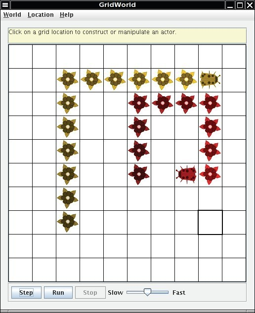
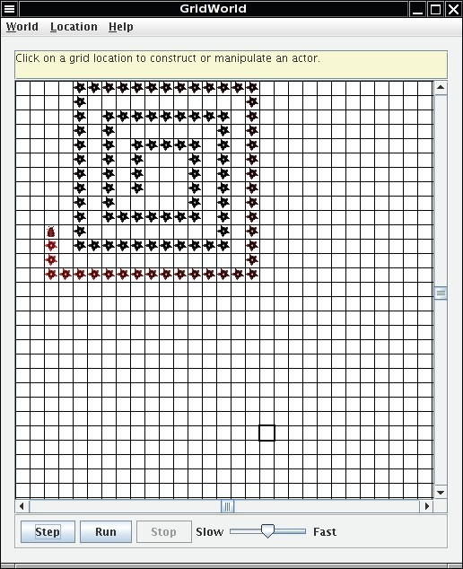
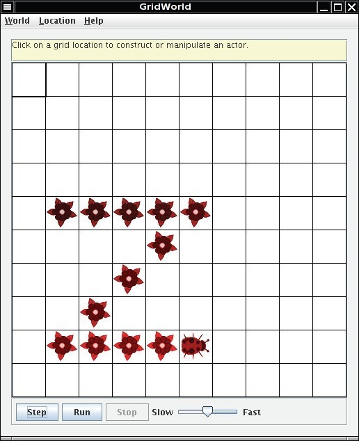

# Part2：Bug Variations

* TOC
{:toc}


---


## Methods of the Bug Class

The Bug class provides three methods that specify how bugs move and turn.
```java
// tests whether the bug can move forward into a location that is empty or contains aflower
public boolean canMove()

// moves the bug forward, putting a flower into the location it previously occupied
public void move()

// turns the bug 45 degrees to the right without changing its location
public void turn()
```

These methods are used in the bug's `act` method.
```java
public void act()
{
    if (canMove())
        move();
    else
        turn();
}
```


----------


## Extending the Bug Class




### **Answer the following questions on Matrix**

**Set 2**
The source code for the BoxBug class can be found in the boxBug directory.

 1. What is the role of the instance variable sideLength?
 2. What is the role of the instance variable steps?
 3. Why is the turn method called twice when steps becomes equal to sideLength?
 4.  Why can the move method be called in the BoxBug class when there is no move method in the BoxBug code?
 5.  After a BoxBug is constructed, will the size of its square pattern always be the same? Why or why not?
 6.  Can the path a BoxBug travels ever change? Why or why not?
 7.  When will the value of steps be zero?


----------


## Runner Classes
In order to observe the behavior of one or more actors, a "runner" class is required. That class constructs an ActorWorld object, places actors into it, and shows the world. For the bug, this class is BugRunner. For the boxbug, it is BoxBugRunner. In each of these runner classes, the overloaded add method is used to place actors (instances of classes such as Bug, BoxBug, Rock) into the grid of the ActorWorld. The add method with an Actor parameter and a Location parameter places an actor at a specified location. The add method with an Actor parameter but no Location parameter places an actor at a random empty location. When you write your own classes that extend Bug, you also need to create a similar runner class.


----------


## Coding Exercises
In the following exercises, write a new class that extends the `Bug` class. Override the `act` method to define the new behavior.

 1. Write a class `CircleBug` that is identical to `BoxBug`, except that in the `act` method the `turn` method is called once instead of twice. How is its behavior different from a `BoxBug`?
 2. Write a class `SpiralBug` that drops flowers in a spiral pattern. Hint: Imitate `BoxBug`, but adjust the side length when the bug turns. You may want to change the world to an UnboundedGrid to see the spiral pattern more clearly.
    

 3. Write a class `ZBug` to implement bugs that move in a "Z" pattern, starting in the top left corner. After completing one "Z" pattern, a `ZBug` should stop moving. In any step, if a `ZBug` can't move and is still attempting to complete its "Z" pattern, the `ZBug` does not move and should not turn to start a new side. Supply the length of the "Z" as a parameter in the constructor. The following image shows a "Z" pattern of length 4. Hint: Notice that a `ZBug` needs to be facing east before beginning its "Z" pattern.

    

 4. Write a class `DancingBug` that "dances" by making different turns before each move. The `DancingBug` constructor has an integer array as parameter. The integer entries in the array represent how many times the bug turns before it moves. For example, an array entry of 5 represents a turn of 225 degrees (recall one turn is 45 degrees). When a dancing bug acts, it should turn the number of times given by the current array entry, then act like a Bug. In the next move, it should use the next entry in the array. After carrying out the last turn in the array, it should start again with the initial array value so that the dancing bug continually repeats the same turning pattern.
    The `DancingBugRunner` class should create an array and pass it as aparameter to the `DancingBug` constructor.

 5. Study the code for the `BoxBugRunner` class. Summarize the steps you would use to add another `BoxBug` actor to the grid.

    ```java
    /**
    * BoxBugRunner.java
    */

    import info.gridworld.actor.ActorWorld;
    import info.gridworld.grid.Location;
    import java.awt.Color;
    /**
    * This class runs a world that contains box bugs.
    * This class is not tested on the AP CS A and AB exams.
    */
    public class BoxBugRunner
    {
        public static void main(String[] args)
        {
            ActorWorld world = new ActorWorld();
            BoxBug alice = new BoxBug(6);
            alice.setColor(Color.ORANGE);
            BoxBug bob = new BoxBug(3);
            world.add(new Location(7, 8), alice);
            world.add(new Location(5, 5), bob);
            world.show();
        }
    }
    ```

