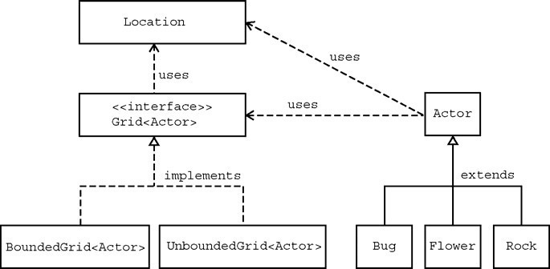
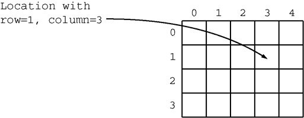
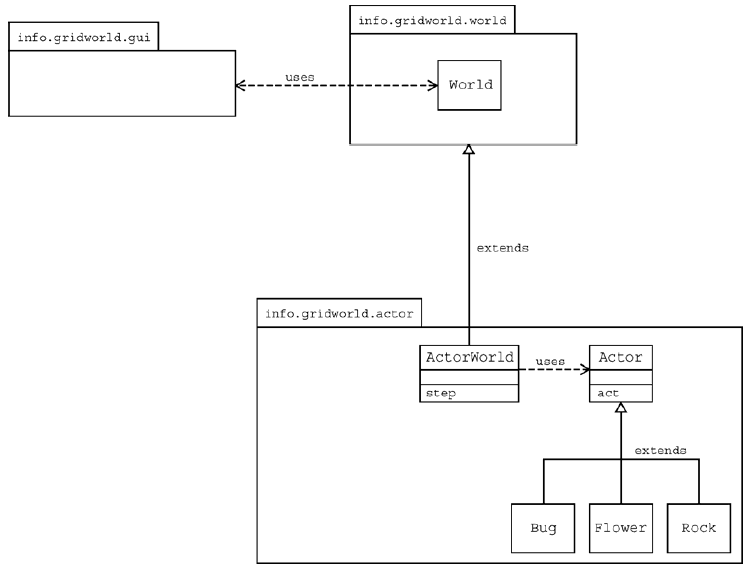

# Part3：GridWorld Classes and Interfaces

* TOC
{:toc}


---


In our example programs, a grid contains actors that are instances of classes that extend the `Actor` class. There are two classes that implement the `Grid` interface: `BoundedGrid` and `UnboundedGrid`. Locations in a grid are represented by objects of the `Location` class. An actor knows the grid in which it is located as well as its current location in the grid. The relationships among these classes are shown in the following figure.




----------


## The `Location` Class

Every actor that appears has a location in the grid. The `Location` class encapsulates the coordinates for an actor's position in a grid. It also provides methods that determine relationships between locations and compass directions.



Every actor in the grid also has a direction. Directions are represented by compass directions measured in degrees: 0 degrees is north, 45 degrees is northeast, 90 degrees is east, etc. The Location class provides eight constants that specify the compass directions.

```java
public static final int NORTH = 0;
public static final int EAST = 90;
public static final int SOUTH = 180;
public static final int WEST = 270;
public static final int NORTHEAST = 45;
public static final int SOUTHEAST = 135;
public static final int SOUTHWEST = 225;
public static final int NORTHWEST = 315;
```

In addition, the `Location` class specifies constants for commonly used turn angles. For example, `Location.HALF_RIGHT` denotes a turn by 45 degrees. Here are the constants for the turn angles.

```java
public static final int LEFT = -90;
public static final int RIGHT = 90;
public static final int HALF_LEFT = -45;
public static final int HALF_RIGHT = 45;
public static final int FULL_CIRCLE = 360;
public static final int HALF_CIRCLE = 180;
public static final int AHEAD = 0;
```

To make an actor turn by a given angle, set its direction to the sum of the current direction and the turn angle. For example, the `turn` method of the `Bug` class makes this call.

```java
setDirection(getDirection() + Location.HALF_RIGHT);
```

A location in a grid has a row and a column. These values are parameters of the `Location` constructor.

```java
public Location(int r, int c);
```

Two accessor methods are provided to return the row and column for a location.

```java
public int getRow();
public int getCol();
```

Two other `Location` methods give information about the relationships between locations and directions.
```java
// returns the adjacent location in the compass direction that is closest to direction
public Location getAdjacentLocation(int direction);

// returns the closest compass direction from this location toward target
public int getDirectionToward(Location target);
```

For example, assume you have the statement below.

```java
Location loc1 = new Location(5, 7);
```


The following statements will result in the values indicated by the comments.

```java
// loc2 has row 5, column 6
Location loc2 = loc1.getAdjacentLocation(Location.WEST);
// loc3 has row 4, column 8
Location loc3 = loc1.getAdjacentLocation(Location.NORTHEAST);
// dir has value 135 (degrees)
int dir = loc1.getDirectionToward(new Location(6, 8));
```

Note that the row values increase as you go south (down the screen) and the column values increase as you go east (to the right on the screen).

The `Location` class defines the equals method so that `loc`.`equals`(other) returns `true` if other is a `Location` object with the same row and column values as `loc` and returns `false` otherwise.

The `Location` class implements the `Comparable` interface. The `compareTo` method compares two `Location` objects. The method call `loc.compareTo`(other) returns a negative integer if `loc` has a smaller row coordinate than `other`, or if they have the same row and `loc` has a smaller column coordinate than `other`. The call returns 0 if `loc` and `other` have the same row and column values. Otherwise, the call returns a positive integer.


### **Answer the following questions on Matrix**

**Set 3**

Assume the following statements when answering the following questions.

```java
Location loc1 = new Location(4, 3);
Location loc2 = new Location(3, 4);
```

 1. How would you access the row value for loc1?
 2. What is the value of b after the following statement is executed?
 ```java
 boolean b = loc1.equals(loc2);
 ```

 3. What is the value of loc3 after the following statement is executed?
 ```java
 Location loc3 = loc2.getAdjacentLocation(Location.SOUTH);
 ```

 4. What is the value of dir after the following statement is executed?
 ```java
 int dir = loc1.getDirectionToward(new Location(6, 5));
 ```

 5. How does the getAdjacentLocation method know which adjacent location to return?


----------


## The Grid Interface

The interface Grid\<E\> specifies the methods for any grid that contains objects of the type E. Two classes, BoundedGrid\<E\> and UnboundedGrid\<E\> implement the interface.

You can check whether a given location is within a grid with this method.

```java
// Precondition: loc is not null
// returns true if loc is valid in this grid, false otherwise
boolean isValid(Location loc);
```

All methods in this case study have the implied precondition that their  parameters are not null. The precondition is emphasized in this method to eliminate any doubt whether null is a valid or invalid location. The null reference does not refer to any location, and you must not pass null to the `isValid` method.

The following three methods allow us to put objects into a grid, remove objects from a grid, and get a reference to an object in a grid.

```java
// Precondition: (1) loc is valid in this grid (2) obj is not null
// puts obj at location loc in this grid and returns the object previously at that location \
//  (or null if the location was previously unoccupied)
E put(Location loc, E obj);

// Precondition: loc is valid in this grid
// removes the object at location loc and returns it \
//  (or null if the location is unoccupied)
E remove(Location loc);

// Precondition: loc is valid in this grid
// returns the object at location loc \
//  (or null if the location is unoccupied)
E get(Location loc);
```

An additional method returns all occupied locations in a grid.

```java
ArrayList<Location> getOccupiedLocations();
```

Four methods are used to collect adjacent locations or neighbor elements of a given location in a grid. The use of these methods is demonstrated by the examples in Part 4.

```java
// Precondition: loc is valid in this grid
// returns all valid locations adjacent to loc in this grid
ArrayList<Location> getValidAdjacentLocations(Location loc);

// Precondition: loc is valid in this grid
// returns all valid empty locations adjacent to loc in this grid
ArrayList<Location> getEmptyAdjacentLocations(Location loc);

// Precondition: loc is valid in this grid
// returns all valid occupied locations adjacent to loc in this grid
ArrayList<Location> getOccupiedAdjacentLocations(Location loc);

// Precondition: loc is valid in this grid
// returns all objects in the occupied locations adjacent to loc in this grid
ArrayList<E> getNeighbors(Location loc);
```

Finally, you can get the number of rows and columns of a grid.

```java
int getNumRows();
int getNumCols();
```

For unbounded grids, these methods return -1.

### **Answer the following questions on Matrix**

**Set 4**

 1. How can you obtain a count of the objects in a grid? How can you obtain a count of the empty locations in a bounded grid?
 2. How can you check if location (10,10) is in a grid?
 3. Grid contains method declarations, but no code is supplied in the methods. Why? Where can you find the implementations of these methods?
 4. All methods that return multiple objects return them in an ArrayList. Do you think it would be a better design to return the objects in an array? Explain your answer.


----------


## The `Actor` Class

The following accessor methods of the Actor class provide information about the state of the actor.

```java
public Color getColor();
public int getDirection();
public Grid<Actor> getGrid();
public Location getLocation();
```

One method enables an actor to add itself to a grid; another enables the actor to remove itself from the grid.

```java
public void putSelfInGrid(Grid<Actor> gr, Location loc);
public void removeSelfFromGrid();
```

The putSelfInGrid method establishes the actor's location as well as the grid in which it is placed. The removeSelfFromGrid method removes the actor from its grid and makes the actor's grid and location both null.

When adding or removing actors, do not use the put and remove methods of the Grid interface. Those methods do not update the location and grid instance variables of the actor. That is a problem since most actors behave incorrectly if they do not know their location. To ensure correct actor behavior, always use the putSelfInGrid and removeSelfFromGrid methods of the Actor class.

To move an actor to a different location, use the following method.

```java
public void moveTo(Location loc);
```

The move to method allows the actor to move to any valid location. If the actor calls moveTo for a location that contains another actor, the other one removes itself from the grid and this actor moves into that location.

You can change the direction or color of an actor with the methods below.

```java
public void setColor(Color newColor);
public void setDirection(int newDirection);
```

These Actor methods provide the tools to implement behavior for an actor. Any class that extends Actor defines its behavior by overriding the act method.

```java
public void act();
```

The act method of the Actor class reverses the direction of the actor. You override this method in subclasses of Actor to define actors with different behavior. If you extend Actor without specifying an act method in the subclass, or if you add an Actor object to the grid, you can observe that the actor flips back and forth with every step.

The Bug, Flower, and Rock classes provide examples of overriding the act method.

The following questions help analyze the code for Actor.


### **Answer the following questions on Matrix**

**Set 5**

 1. Name three properties of every actor.
 2. When an actor is constructed, what is its direction and color?
 3. Why do you think that the Actor class was created as a class instead of an interface?
 4. Can an actor put itself into a grid twice without first removing itself? Can an actor remove itself from a grid twice? Can an actor be placed into a grid, remove itself, and then put itself back? Try it out. What happens?
 5. How can an actor turn 90 degrees to the right?


----------


## Extending the Actor Class

The Bug, Flower, and Rock classes extend Actor in different ways. Their behavior is specified by how they override the act method.

**The Rock Class**

A rock acts by doing nothing at all. The act method of the Rock class has an empty body.

**The Flower Class**

A flower acts by darkening its color, without moving. The act method of the Flower class reduces the values of the red, green, and blue components of the color by a constant factor.

**The Bug Class**

A bug acts by moving forward and leaving behind a flower. A bug cannot move into a location occupied by a rock, but it can move into a location that is occupied by a flower, which is then removed. If a bug cannot move forward because the location in front is occupied by a rock or is out of the grid, then it turns right 45 degrees.

In Part 2, exercises were given to extend the Bug class. All of the exercises required the act method of the Bug class to be overridden to implement the desired behavior. The act method uses the three auxiliary methods in the Bug class: canMove, move, and turn. These auxiliary methods call methods from Actor, the superclass.

The canMove method determines whether it is possible for this Bug to move. It uses a Java operator called instanceof (not part of the AP CS Java subset). This operator is used as in the following way.


*expr instanceof Name*

Here, expr is an expression whose value is an object and Name is the name of a class or interface type. The instanceof operator returns true if the object has the specified type. If Name is a class name, then the object must be an instance of that class itself or one of its subclasses. If Name is an interface name, then the object must belong to a class that implements the interface.

This statement in the canMove method checks whether the object in the adjacent location is null or if it is a Flower.

```java
return (neighbor == null) || (neighbor instanceof Flower);
```

The following statement in the canMove method checks that the bug is actually in a grid---it would be possible for the bug not to be in a grid if some other actor removed it.

```java
if (gr == null) return false;
```
```java
The other code for canMove is explored in the questions at the end of this section.
```
```java
The move method for Bug moves it to the location immediately in front and puts a flower in its previous location.
The turn method for Bug turns it 45 degrees to the right. 
The code for these methods is explored in the following questions.
```


### **Answer the following questions on Matrix**

**Set 6**

 1. Which statement(s) in the canMove method ensures that a bug does not
try to move out of its grid?
 2. Which statement(s) in the canMove method determines that a bug will
not walk into a rock?
 3. Which methods of the Grid interface are invoked by the canMove method and why?
 4. Which method of the Location class is invoked by the canMove method and why?
 5. Which methods inherited from the Actor class are invoked in the canMove method?
 6. What happens in the move method when the location immediately in front of the bug is out of the grid?
 7. Is the variable loc needed in the move method, or could it be avoided by calling getLocation() multiple times?
 8. Why do you think the flowers that are dropped by a bug have the same color as the bug?
 9. When a bug removes itself from the grid, will it place a flower into its previous location?
 10. Which statement(s) in the move method places the flower into the grid at the bug's previous location?
 11. If a bug needs to turn 180 degrees, how many times should it call the turn method?


----------


## Coding exercises

You are asked to create a class called Jumper. This actor can move forward two cells in each move. It "jumps" over rocks and flowers. It does not leave anything behind it when it jumps.

 1. Inception: clarify the details of the problem:

    a. What will a jumper do if the location in front of it is empty, but the location two cells in front contains a flower or a rock?

    b. What will a jumper do if the location two cells in front of the jumper is out of the grid?

    c. What will a jumper do if it is facing an edge of the grid?

    d. What will a jumper do if another actor (not a flower or a rock) is in the cell that is two cells in front of the jumper?

    e. What will a jumper do if it encounters another jumper in its path?

    f. Are there any other tests the jumper needs to make?

    \* You should answer the above questions **simply** in your design
    report.

 2. Elaboration: solve the following problems:

    a. Which class should Jumper extend?

    b. Is there an existing class that is similar to the Jumper class?

    c. Should there be a constructor? If yes, what parameters should be specified for the constructor?

    d. Which methods should be overridden?

    e. What methods, if any, should be added?

    f. What is the plan for testing the class?

    \* You don't need to write down your answers to this group of questions, just think about them and go to the construction part.

 3. Construction: Implement the Jumper and JumperRunner classes.

 4. Test: Carry out the test plan with junit to verify that the Jumper class meets the specification.

Finally, you should hand out your design report(`"designreport.md"`),
test report(`"testreport.md"`), and source code("Jumper.java" & "JumperRunner.java"&"JumperTest.java"。 **源代码(不包括文档)** 打包成一个zip，命名格式(`"Part3.zip"`). 设计文档只需回答1.Inception的问题，不需写其他设计思路。


----------


## What Makes It Run? (Optional)

A graphical user interface (GUI) has been provided for running GridWorld programs. The World class makes the connection between the GUI and the classes already described. The GUI asks the world for its grid, locates the grid occupants, and draws them. The GUI allows the user to invoke the step method of the world, either taking one step at a time or running continuously. After each step, the GUI redisplays the grid.

For our actors, a subclass of the World class called ActorWorld is provided. ActorWorld defines a step method that invokes act on each actor.

Other worlds can be defined that contain occupants other than actors. By providing different implementations of the step method and other methods of the World class, one can produce simulations, games, and so on.

In order to display the GUI, a runner program constructs a world, adds occupants to it, and invokes the show method on the world. That method causes the GUI to launch.

The ActorWorld class has a constructor with a Grid\<Actor\> parameter. Use that constructor to explore worlds with grids other than the default 10 x 10 grid.

The ActorWorld has two methods for adding an actor.

```java
public void add(Location loc, Actor occupant);
public void add(Actor occupant);
```

The add method without a Location parameter adds an actor at a random empty location.

When adding actors to a world, be sure to use the add method of the ActorWorld class and not the put method of the Grid interface. The add method calls the Actor method putSelfInGrid. As explained previously, the putSelfInGrid method sets the actor's references to its grid and location and calls the grid method put, giving the grid a reference to the actor.

The remove method removes an actor from a given location and returns the Actor that has been removed.

```java
public Actor remove(Location loc);
```

The relationship between the GUI, world, and actor classes is shown in the following figure. Note that the GUI has no knowledge of actors. It can show occupants in any world. Conversely, actors have no knowledge of the GUI.



