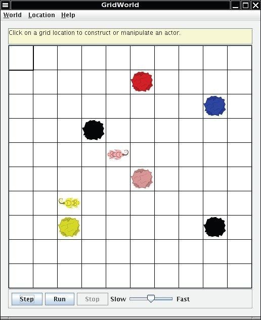
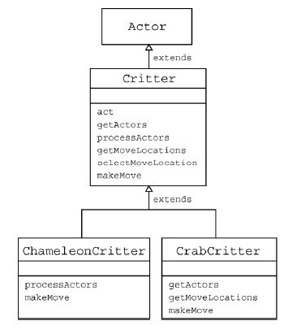
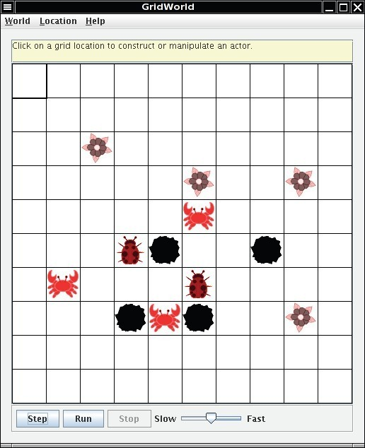

# Part4：Interacting Objects

* TOC
{:toc}


---


## The Critter Class

Critters are actors that share a common pattern of behavior, but the details may vary for each type of critter. When a critter acts, it first gets a list of actors to process. It processes those actors and then generates the set of locations to which it may move, selects one, and moves to that location.

Different types of critters may select move locations in different ways, may have different ways of selecting among them, and may vary the actions they take when they make the move. For example, one type of critter might get all the neighboring actors and process each one of them in some way (change their color, make them move, and so on). Another type of critter may get only the actors to its front, front-right, and front-left and randomly select one of them to eat. A simple critter may get all the empty neighboring locations, select one at random, and move there. A more complex critter may only move to the location in front or behind and make a turn if neither of these locations is empty.

Each of these behaviors fits a general pattern. This general pattern is defined in the act method for the Critter class, a subclass of Actor. This act method invokes the following five methods.

```java
ArrayList<Actor> getActors();
void processActors(ArrayList<Actor> actors);
ArrayList<Location> getMoveLocations();
Location selectMoveLocation(ArrayList<Location> locs);
void makeMove(Location loc);
```

These methods are implemented in the Critter class with simple default behavior--- see the following section. Subclasses of Critter should override one or more of these methods.

It is usually not a good idea to override the `act` method in a `Critter` subclass. The `Critter` class was designed to represent actors that process other actors and then move. If you find the `act` method unsuitable for your actors, you should consider extending Actor, not `Critter`.

### **Answer the following questions on Matrix**

**Set 7**

The source code for the Critter class is in the critters directory

 1. What methods are implemented in Critter?
 2. What are the five basic actions common to all critters when they act?
 3. Should subclasses of Critter override the getActors method? Explain.
 4. Describe the way that a critter could process actors.
 5. What three methods must be invoked to make a critter move? Explain each of these methods.
 6. Why is there no Critter constructor?


----------


## Default Critter Behavior

Before moving, critters process other actors in some way. They can examine them, move them, or even eat them.

There are two steps involved:

 1. Determination of which actors should be processed
 2. Determination of how they should be processed

The getActors method of the Critter class gets a list of all neighboring actors. This behavior can be inherited in subclasses of Critter. Alternatively, a subclass can decide to process a different set of actors, by overriding the getActors method.

The processActors method in the Critter class eats (that is, removes) actors that are not rocks or critters. This behavior is either inherited or overridden in subclasses.

When the critter has completed processing actors, it moves to a new location. This is a three-step process.

 1. Determination of which locations are candidates for the move
 2. Selection of one of the candidates
 3. Making the move

Each of these steps is implemented in a separate method. This allows subclasses to change each behavior separately.

The Critter implementation of the getMoveLocations method returns all empty adjacent locations. In a subclass, you may want to compute a different set of locations. One of the examples in the case study is a CrabCritter that can only move sideways.

Once the candidate locations have been determined, the critter needs to select one of them. The Critter implementation of selectMoveLocation selects a location at random. However, other critters may want to work harder and pick the location they consider best, such as the one with the most food or the one closest to their friends.

Finally, when a location has been selected, it is passed to the makeMove method. The makeMove method of the Critter class simply calls moveTo, but you may want to override the makeMove method to make your critters turn, drop a trail of rocks, or take other actions.

Note that there are postconditions on the five Critter methods called by act. When you override these methods, you should maintain these postconditions.

The design philosophy behind the Critter class is that the behavior is carried outin separate phases, each of which can be overridden independently. The postconditions help to ensure that subclasses implement behavior that is consistentwith the purpose of each phase.


----------


## Extending the Critter Class

The ChameleonCritter class defines a new type of critter that gets the same neighboring actors as a Critter. However, unlike a Critter, a ChameleonCritter doesn't process actors by eating them. Instead, when a ChameleonCritter processes actors, it randomly selects one and changes its own color to the color of the selected actor.



The ChameleonCritter class also overrides the makeMove method of the Critter class. When a ChameleonCritter moves, it turns toward the new location.

The following figure shows the relationships among Actor, Critter, andChameleonCritter, as well as the CrabCritter class that is discussed in the following section.




### **Answer the following questions on Matrix**

**Set 8**
The source code for the ChameleonCritter class is in the critters directory

 1. Why does act cause a ChameleonCritter to act differently from a Critter even though ChameleonCritter does not override act?
 2. Why does the makeMove method of ChameleonCritter call super.makeMove?
 3. How would you make the ChameleonCritter drop flowers in its old location when it moves?
 4. Why doesn't ChameleonCritter override the getActors method?
 5. Which class contains the getLocation method?
 6. How can a Critter access its own grid?


----------


## Another Critter

A CrabCritter is a critter that eats whatever is found in the locations immediately in front, to the right-front, or to the left-front of it. It will not eat a rock or another critter (this restriction is inherited from the Critter class). A CrabCritter can move only to the right or to the left. If both locations are empty, it randomly selects one. If a CrabCritter cannot move, then it turns 90 degrees, randomly to the left or right.




### **Answer the following questions on Matrix**

**Set 9**

The source code for the CrabCritter class is reproduced at the end of this part of GridWorld.

 1. Why doesn't CrabCritter override the processActors method?
 2. Describe the process a CrabCritter uses to find and eat other actors. Does it always eat all neighboring actors? Explain.
 3. Why is the getLocationsInDirections method used in CrabCritter?
 4. If a CrabCritter has location (3, 4) and faces south, what are the possible locations for actors that are returned by a call to the getActors method?
 5. What are the similarities and differences between the movements of a CrabCritter and a Critter?
 6. How does a CrabCritter determine when it turns instead of moving?
 7. Why don't the CrabCritter objects eat each other?


----------


## Coding Exercises

 1. Modify the processActors method in ChameleonCritter so that if the list of actors to process is empty, the color of the ChameleonCritter will darken (like a flower).

In the following exercises, your first step should be to decide which of the five methods---getActors, processActors, getMoveLocations, selectMoveLocation, and makeMove---should be changed to get the desired result.

 2. Create a class called ChameleonKid that extends ChameleonCritter as modified in exercise 1. A ChameleonKid changes its color to the color of one of the actors immediately in front or behind. If there is no actor in either of these locations, then the ChameleonKid darkens like the modified ChameleonCritter.
 3. Create a class called RockHound that extends Critter. A RockHound gets the actors to be processed in the same way as a Critter. It removes any rocks in that list from the grid. A RockHound moves like a Critter.
 4. Create a class BlusterCritter that extends Critter. A BlusterCritter looks at all of the neighbors within two steps of its current location. (For a BlusterCritter not near an edge, this includes 24 locations). It counts the number of critters in those locations. If there are fewer than c critters, the BlusterCritter's color gets brighter (color values increase). If there are c or more critters, the BlusterCritter's color darkens (color values decrease). Here, c is a value that indicates the courage of the critter. It should be set in the constructor.
 5. Create a class QuickCrab that extends CrabCritter. A QuickCrab processes actors the same way a CrabCritter does. A QuickCrab moves to one of the two locations, randomly selected, that are two spaces to its right or left, if that location and the intervening location are both empty. Otherwise, a QuickCrab moves like a CrabCritter.
 6. Create a class KingCrab that extends CrabCritter. A KingCrab gets the actors to be processed in the same way a CrabCritter does. A KingCrab causes each actor that it processes to move one location further away from the KingCrab. If the actor cannot move away, the KingCrab removes it from the grid. When the KingCrab has completed processing the actors, it moves like a CrabCritter.

