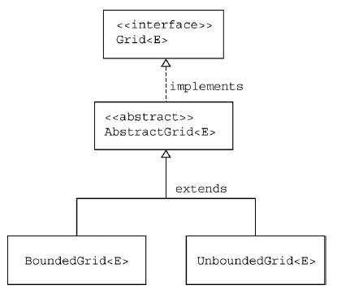
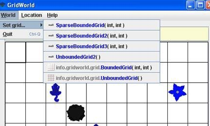

# Part5：Grid Data Structures

* TOC
{:toc}


---


## Step1：The AbstractGrid Class

Two concrete implementations of the Grid interface are provided, one for a bounded grid that has a fixed number of rows and columns, and a second for an unbounded grid, for which any row and column values are valid. Rather than have repeated code in two classes, the AbstractGrid class defines five methods of the Grid interface that are common to both implementations.

```java
public ArrayList<E> getNeighbors(Location loc);
public ArrayList<Location> getValidAdjacentLocations(Location loc);
public ArrayList<Location> getEmptyAdjacentLocations(Location loc);
public ArrayList<Location> getOccupiedAdjacentLocations(Location loc);
public String toString();
```

The code for these methods uses other methods specified in the interface. Here is the definition of the getNeighbors method. Note that the same method works for bounded and unbounded grids.

```java
public ArrayList<E> getNeighbors(Location loc)
{
    ArrayList<E> neighbors = new ArrayList<E>();
    for (Location neighborLoc : getOccupiedAdjacentLocations(loc))
        neighbors.add(get(neighborLoc));
    return neighbors;
}
```

The AbstractGrid class is a superclass of the BoundedGrid and UnboundedGrid classes. Since AbstractGrid does not define all methods specified by the Grid interface, it is an abstract class. The concrete BoundedGrid and UnboundedGrid classes define the methods of the Grid interface that are not defined in AbstractGrid. This design is illustrated in the following figure.




### **Answer the following questions on Matrix**

**Set 10**

The source code for the AbstractGrid class is in Appendix D.

 1. Where is the isValid method specified? Which classes provide an implementation of this method?
 2. Which AbstractGrid methods call the isValid method? Why don't the other methods need to call it?
 3. Which methods of the Grid interface are called in the getNeighbors method? Which classes provide implementations of these methods?
 4. Why must the get method, which returns an object of type E, be used in the getEmptyAdjacentLocations method when this method returns locations, not objects of type E?
 5. What would be the effect of replacing the constant Location.HALF_RIGHT with Location.RIGHT in the two places where it occurs in the getValidAdjacentLocations method?


----------


## Step2：The BoundedGrid Class

A bounded grid has a fixed number of rows and columns. You can access only locations that are within the bounds of the grid. If you try to access an invalid location, a run-time exception will be thrown.

The BoundedGrid<E> class stores grid occupants in a two-dimensional array.

```java
private Object[][] occupantArray;
```

Note that occupantArray is declared to hold references of type Object rather than the generic type E. (In the Java language, it is impossible to declare arrays of generic types.) Nevertheless, all elements of occupantArray must belong to the type E. Only the put method adds elements to the array, and it requires elements of type E.


### **Answer the following questions on Matrix**

**Set 11**

The source code for the BoundedGrid class is in Appendix D.

 1. What ensures that a grid has at least one valid location?
 2. How is the number of columns in the grid determined by the getNumCols method? What assumption about the grid makes this possible?
 3. What are the requirements for a Location to be valid in a BoundedGrid?

In the next four questions, let r = number of rows, c = number of columns, and n = number of occupied locations.

 4. What type is returned by the getOccupiedLocations method? What is the time complexity (Big-Oh) for this method?
 5. What type is returned by the get method? What parameter is needed? What is the time complexity (Big-Oh) for this method?
 6. What conditions may cause an exception to be thrown by the put method? What is the time complexity (Big-Oh) for this method?
 7. What type is returned by the remove method? What happens when an attempt is made to remove an item from an empty location? What is the time complexity (Big-Oh) for this method?
 8. Based on the answers to questions 4, 5, 6, and 7, would you consider this an efficient implementation? Justify your answer.


----------


## Step3：The UnboundedGrid Class

**In an unbounded grid, any location is valid, even when the row or column is negative or very large. Since there is no bound on the row or column of a location in this grid, the `UnboundedGrid<E>` class does not use a fixed size two-dimensional array. Instead, it stores occupants in a `Map<Location, E>`. The key type of the map is Location and the value type is E, the type of the grid occupants.**

The numRows and numCols methods both return -1 to indicate that an unbounded grid does not have any specific number of rows or columns. The isValid method always returns true. The get, put, and remove methods simply invoke the corresponding Map methods. The getOccupiedLocations method returns the same locations that are contained in the key set for the map.

### **Answer the following questions on Matrix**

**Set 12**

The source code for the UnboundedGrid class is in Appendix D.

 1. Which method must the Location class implement so that an instance of HashMap can be used for the map? What would be required of the Location class if a TreeMap were used instead? Does Location satisfy these requirements?
 2. Why are the checks for null included in the get, put, and remove methods? Why are no such checks included in the corresponding methods for the BoundedGrid?
 3. What is the average time complexity (Big-Oh) for the three methods: get, put, and remove? What would it be if a TreeMap were used instead of a HashMap?
 4. How would the behavior of this class differ, aside from time complexity, if a TreeMap were used instead of a HashMap?
 5. Could a map implementation be used for a bounded grid? What advantage, if any, would the two-dimensional array implementation that is used by the BoundedGrid class have over a map implementation?


----------


## Coding Exercises

 1. Suppose that a program requires a very large bounded grid that contains very few objects and that the program frequently calls the getOccupiedLocations method (as, for example, ActorWorld). Create a class SparseBoundedGrid that uses a "sparse array" implementation. Your solution need not be a generic class; you may simply store occupants of type Object.

    The "sparse array" is an array list of linked lists. Each linked list entry holds both a grid occupant and a column index. Each entry in the array list is a linked list or is null if that row is empty.

    You may choose to implement the linked list in **one of two** ways. You can use raw list nodes.
    ```java
    public class SparseGridNode
    {
        private Object occupant;
        private int col;
        private SparseGridNode next;
        ... ...
    }
    ```

    **Or** you can use a LinkedList<OccupantInCol> with a helper class.
    ```java
    public class OccupantInCol
    {
        private Object occupant;
        private int col;
        ... ...
    }
    ```

    For a grid with r rows and c columns, the sparse array has length r. Each of the linked lists has maximum length c.

    Implement the methods specified by the Grid interface using this data structure. Why is this a more time-efficient implementation than BoundedGrid?

    The World has a public addGridClass method. Since the ActorWorld is a World, you can call this method in a runner. Here is the code to add a new grid to the GUI.
    ```java
    import info.gridworld.actor.Actor;
    import info.gridworld.actor.ActorWorld;
    import info.gridworld.grid.Location;
    import info.gridworld.actor.Critter;
    import info.gridworld.actor.Rock;
    import info.gridworld.actor.Flower;
    /**
     * This class runs a world with additional grid choices.
     */
    public class SparseGridRunner
    {
        public static void main(String[] args)
        {
            ActorWorld world = new ActorWorld();
            world.addGridClass("SparseBoundedGrid");
            world.addGridClass("SparseBoundedGrid2");
            world.addGridClass("SparseBoundedGrid3");
            world.addGridClass("UnboundedGrid2");
            world.add(new Location(2, 2), new Critter());
            world.show();
        }
    }
    ```
    
    Note that you should firstly compile the SparseBoundedGrid.java to generate the SparseBoundedGrid.class.
    
    When you execute a runner class and choose the World menu->set grid, the new grid type will be available for you to choose.

    

 2. Consider using a `HashMap` **or** `TreeMap` to implement the `SparseBoundedGrid`. How could you use the UnboundedGrid class to accomplish this task? Which methods of `UnboundedGrid` could be used without change?
    Fill in the following chart to compare the expected Big-Oh efficiencies for each implementation of the `SparseBoundedGrid`.
    
    Let r = number of rows, c = number of columns, and n = number of occupied locations

    | Methods | `SparseGridNode` version | `LinkedList<OccupantInCol>` version | `HashMap` version | `TreeMap`  version |
    | :----: | :----: | :----: | :----: | :----: |
    | `getNeighbors` |  |  |  |  |
    | `getEmptyAdjacentLocations` |  |  |  |  |
    | `getOccupiedAdjacentLocations` |  |  |  |  |
    | `getOccupiedLocations` |  |  |  |  |
    | `get` |  |  |  |  |
    | `put` |  |  |  |  |
    | `remove` |  |  |  |  |

 3. Consider an implementation of an unbounded grid in which all valid locations have non-negative row and column values. The constructor allocates a 16 x 16 array. When a call is made to the put method with a row or column index that is outside the current array bounds, double both array bounds until they are large enough, construct a new square array with those bounds, and place the existing occupants into the new array.
    Implement the methods specified by the Grid interface using this data structure. What is the Big-Oh efficiency of the get method? What is the efficiency of the put method when the row and column index values are within the current array bounds? What is the efficiency when the array needs to be resized?
