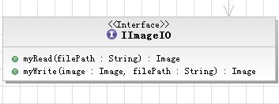
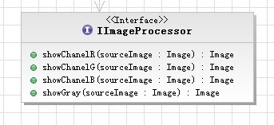
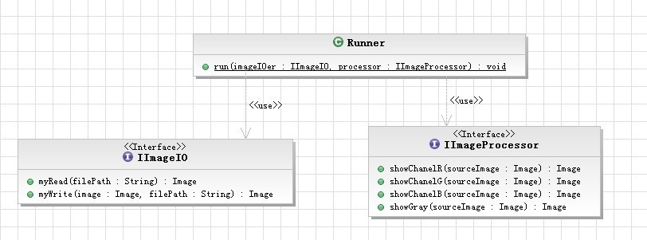
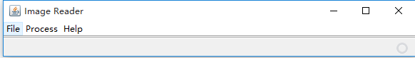

# ImageProcessing

* TOC
{:toc}


----------


## 一． 实验简介
图像的本质就是一个存放着每个像素颜色值信息的矩阵。为了让同学们更好地体会这点，本实验要求同学们利用本实验软装置，实现一个利用二进制流读取Bitmap图像，并且能够进行简单地处理和保存的软件。本实验需要到扩展库[ImageReader](./resources/imagereader_code.zip)和测试图片集[bmptest.zip](./resources/bmptest_v3.zip)。


----------


## 二． Bitmap 文件结构介绍
Bitmap文件结构，可以参考：[http://blog.csdn.net/sjzlxd/article/details/3923907](http://blog.csdn.net/sjzlxd/article/details/3923907)

### 1. 什么是Bitmap
BMP取自位图BitMaP的缩写，也称为DIB（与设备无关的位图）是微软视窗图形子系统（Graphics Device Interface）内部使用的一种位图图形格式，它是微软视窗平台上的一个简单的图形文件格式。

### 2. Bitmap文件结构
典型的位图文件格式通常包含下面几个数据块：
 - **位图头**： 保存位图文件的总体信息。
 - **位图信息**： 保存位图图像的详细信息。
 - **调色板**： 保存所用颜色的定义。
 - **位图数据**： 保存一个又一个像素的实际图像。

#### 2.1 位图头
这部分是识别信息，典型的应用程序会首先普通读取这部分数据以确保的确是位图文件并且没有损坏。

| 字节 | 属性 |
| :----: | :----: |
| \#0-1 | 保存位图文件的标识符，这两个字节的典型数据是BM |
| \#2-5 | 使用一个dword保存位图文件大小 |
| \#6-9 | 是保留部分，留做以后的扩展使用,对实际的解码格式没有影响 |
| \#10-13 | 保存位图数据位置的地址偏移，也就是起始地址 |


#### 2.2 位图信息
这部分告诉应用程序图像的详细信息，在屏幕上显示图像将会使用这些信息，它从文件的第15个字节开始。

| 字节 | 属性 |
| :----: | :----: |
| \#14-17 | 定义以下用来描述影像的区块（BitmapInfoHeader）的大小。它的值是：40 - Windows 3.2、95、NT、12 - OS/2 1.x、240 - OS/2 2.x |
| \#18-21 | 保存位图宽度（以像素个数表示） |
| \#22-25 | 保存位图高度（以像素个数表示） |
| \#26-27 | 保存所用彩色位面的个数。不经常使用 |
| \#28-29 | 保存每个像素的位数，它是图像的颜色深度。常用值是1、4、8（灰阶）和24（彩色） |
| \#30-33 | 定义所用的压缩算法。允许的值是0、1、2、3、4、5，见下表 |
| \#34-37 | 保存图像大小。这是原始 **（:en:raw）位图数据的大小，不要与文件大小混淆。** |
| \#38-41 | 保存图像水平方向分辨率 |
| \#42-45 | 保存图像竖值方向分辨率 |
| \#46-49 | 保存所用颜色数目 |
| \#50-53 | 保存所用重要颜色数目。当每个颜色都重要时这个值与颜色数目相等 |


| 压缩算法的值 | 定义 |
| :----: | :----: |
| 0 | 没有压缩（也用BI\_RGB表示 |
| 1 | 行程长度编码 8位/像素（也用BI\_RLE8表示） |
| 2 | 行程长度编码4位/像素（也用BI\_RLE4表示） |
| 3 | Bit field（也用BI\_BITFIELDS表示） |
| 4 | JPEG图像（也用BI\_JPEG表示） |
| 5 | PNG图像（也用BI\_PNG表示） |


#### 2.3 调色板
这部分定义了图像中所用的颜色。如上所述，位图图像一个像素接着一个像素存储，每个像素使用一个或者多个字节的值表示，所以调色板的目的就是要告诉应用程序这些值所对应的实际颜色。

典型的位图文件使用RGB彩色模型。在这种模型中，每种颜色都是由不同强度（从0到最大强度）的红色（R）、绿色（G）和蓝色（B）组成的，也就是说，每种颜色都可以使用红色、绿色和蓝色的值所定义。

在位图文件的实现中，调色板可以包含很多条目，条目个数就是图像中所使用的颜色的个数。每个条目包含4个字节：其中三个表示红色、绿色和蓝色，第四个字节没有使用（大多数应用程序将它设为0）。对于每个字节，数值0表示相应的颜色在当前的图像文件中没有使用，而数值255表示那个颜色使用最大的强度。

#### 2.4 位图数据
这部分逐个像素表示图像。像素是从下到上、从左到右保存的。每个像素使用一个或者多个字节表示。如果一个图像水平线的字节数不是4的倍数，这行就使用空字节补齐，通常是ASCII码0。

范例：

有一张5\*5的图片，应该会有25个pixels，但是因为5不是4的倍数所以会显示成：
xxxxx000 xxxxx000 xxxxx000 xxxxx000 xxxxx000

x代表调色盘的编号 0代表Null\_character

有一张4\*4的图片，应该会有16个pixels，但是因为是4的倍数所以会显示成：xxxx xxxx xxxx xxxx


----------


## 三. 简单的图像处理

### 1． 提取彩色图像的各个色彩通道

#### 1.1 什么是色彩通道
彩色图像的每一个像素是由3个色彩通道组成的（如果算上Alpha通道的话就是4个），它们分别是RGB。如果是24位的位图，那么每一色彩通道就是用一个字节来存储，因此它的取值范围为[sst: 0 , 255 ]。

#### 1.2 提取色彩通道
提取色彩通道就是把一个彩色图像的每个像素的RGB值分别提取出来。例如，提取R通道，则把原来图像每个像素的RGB的R值提取出来，并形成一个新的RGB值（R，0，0）。这样就能以图像的形式把一个彩色图像各个色彩通道显示出来了。

### 2． 将彩色的位图转换成灰度图

#### 2.1 什么是灰度图
灰度（[grayscale](http://en.wikipedia.org/wiki/Grayscale)）数字图像是每个像素只有一个采样颜色的图像。这类图像通常显示为从最暗黑色到最亮的白色的灰度，尽管理论上这个采样可以任何颜色的不同深浅，甚至可以是不同亮度上的不同颜色。灰度图像与黑白图像不同，在计算机图像领域中黑白图像只有黑白两种颜色，灰度图像在黑色与白色之间还有许多级的颜色深度。但是，在数字图像领域之外，"黑白图像"也表示"灰度图像"，例如灰度的照片通常叫做"黑白照片"。

用于显示的灰度图像通常用每个采样像素 8 位的非线性尺度来保存，这样可以有 256 级灰度。这种精度刚刚能够避免可见的条带失真，并且非常易于编程。

#### 2.2 彩色图像转换成灰度图像
将彩色图转换成灰度图，建议采用NTSC推荐的彩色图到灰度图的转换公式：

I = 0.299 \* R + 0.587 \* G + 0.114 \*B，其中R,G,B分别为红、绿、蓝通道的颜色值。

然后将三个色彩通道的颜色值改为这个值即可。这样，原来的彩色图像就变成了灰度图像了。


----------


## 四. 实验要求

根据前面介绍或自己在网上查找的资料，利用本实验提供的软装置实现ImageReader软件，需要实现以下功能：

 1. 利用二进制流读取Bitmap位图文件。注意，这里要求不能使用Java提供的API直接读取图像，根据二进制数据创建Image时可以使用API；
 2. 把读取彩色图像转换成灰度图像；
 3. 提取并且显示彩色图像各个色彩通道；
 4. 把处理完的图像保存为bmp格式图像。注意，这里可以使用Java提供的API完成，但本文档不提供，希望各位同学自行上网查找资料自学。如果学有余力的同学，可以实现按照二进制流输出保存bmp图像；
 5. 编写Junit测试程序，测试输出的图片是否与goal文件夹下的图片一致。（比较位图宽度、位图高度以及像素值）


----------


## 五. 实验软件装置介绍

### 1. 接口
本实验装置共有两个需要同学们实现的接口：

 - `IImageIO` ：

    

 - `IImageProcessor` ：

    

 - 程序对外接口结构 ：

    


### 2. 使用方法
实现imagereader包中的IImageIO和IImageProcessor接口，调用imagereader包中的Runner类中的静态方法run，把IImageIO和IImageProcessor的依赖注入即可。

**Tips**:

 1. 在上文的资料中没有提供可运行的main函数，正确的打开方式如下：
    ```java
    // ImagaReaderRunner.java
    import imagereader.IImageIO;
    import imagereader.IImageProcessor;
    import imagereader.Runner;

    public class ImageReaderRunner {
        public static void main(String[] args) {
            IImageIO imageioer = new ImplementImageIO();
            IImageProcessor processor = new ImplementImageProcessor();
            Runner.run(imageioer, processor);
        }
    }
    ```

    其中，ImplementImageIO实现了IImageIO里边对于图片读写的操作，ImplementImageProcessor实现了IImageProcessor接口里边对于图片单通道提取的操作。

    运行ImageReaderRunner可以得到如下的GUI：

    

 2. 在实现IImageIO的时候，myRead函数需要自己解析bmp二进制文件，而myWrite函数可以使用[java.awt.image](http://docs.oracle.com/javase/7/docs/api/java/awt/image/package-summary.html)里的BufferedImage等，当然方法不唯一。
 3.  可能用到的方法有：

        | 类或方法 | 备注 |
        | :----: | :----: |
        | Toolkit.getDefaultToolkit().createImage([ImageProducer](https://docs.oracle.com/javase/7/docs/api/java/awt/image/ImageProducer.html) producer) | 从像素数组转换成java.awt.Image |
        | [MemoryImageSource](https://docs.oracle.com/javase/7/docs/api/java/awt/image/MemoryImageSource.html)(int w, int h, int[] pix, int off, int scan) | MemoryImageSorce实现了ImageProducer接口 |
        | ImageIO.write([RenderedImage](https://docs.oracle.com/javase/7/docs/api/java/awt/image/RenderedImage.html) im,String formatName,File output) | 把图片写出到文件 |
        | [BufferedImage](https://docs.oracle.com/javase/7/docs/api/java/awt/image/BufferedImage.html)(int width, int height, int imageType) | 实现了RenderedImage接口，Image转换BufferedImage的方法参考[这里](http://stackoverflow.com/questions/13605248/java-converting-image-to-bufferedimage)(遇坑可见热心群众[owtotwo](https://github.com/owtotwo)解决的[Issue 24](https://github.com/se-2018/se-2018.github.io/issues/24)) |

