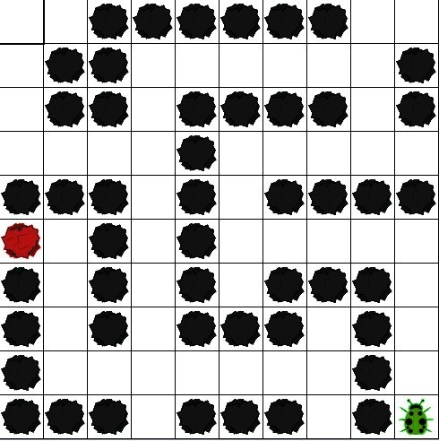
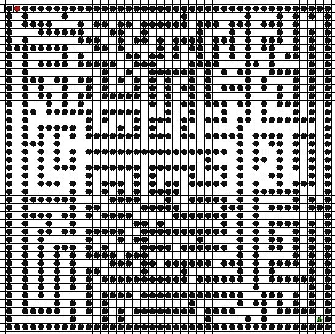
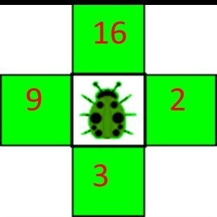
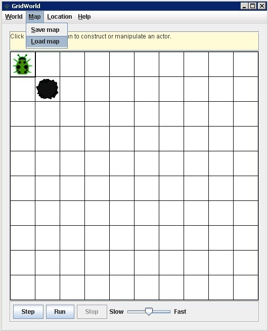

# MazeBug

* TOC
{:toc}

----------

## 一、 实验介绍
无环路迷宫在数据结构上表现为一棵树，采用深度优先搜索算法就可以走出迷宫。本实验的目的是让同学们学习、理解和应用深度优先搜索算法。本实验要求同学们在改进的Grid World软件装置中实现深度优先搜索算法，从而使虫子走出迷宫。本实验需要用到软装置[MazeBug](./resources/mazebug_code.zip)。

图1 无环路迷宫和树的对应关系

----------

## 二、 深度优先搜索算法介绍
 
### 2.1 深度优先搜索算法的基本思想
深度优先搜索算法（Depth-First-Search），是搜索算法的一种。算法沿着树的深度遍历树的节点，尽可能深的搜索树的分支。当节点v的所有边都己被探寻过，搜索将回溯到发现节点v的那条边的起始节点。这一过程一直进行到已发现从源节点可达的所有节点为止。如果还存在未被发现的节点，则选择其中一个作为源节点并重复以上过程。

走迷宫的目标是到达出口所在的叶子节点，所以不用遍历整棵树。

### 2.2 深度优先搜索算法的基本步骤
此算法对应无环路迷宫的树结构。
 1. 先将树的所有节点标记为"未访问"状态。
 2. 输出起始节点，将起始节点标记为"已访问"状态。
 3. 将起始节点入栈。
 4. 当栈非空时重复执行以下步骤：

    a. 取当前栈顶节点。

    b. 如果当前栈顶节点是结束节点（迷宫出口），输出该节点，结束搜索。

    c. 如果当前栈顶节点存在"未访问"状态的邻接节点，则选择一个未访问节点，置为"已访问"状态，并将它入栈，继续步骤a。

    d. 如果当前栈顶节点不存在"未访问"状态的邻接节点，则将栈顶节点出栈，继续步骤a。

----------

## 三、 实验要求
根据前面介绍或自己在网上查找的资料，利用本实验提供的软装置实现MazeBug软件，需要实现以下功能：

### 3.1 基础部分
定义一个继承Bug类的MazeBug类，使虫子的行走方向只有东南西北四个方向，且在碰到迷宫出口（红石头）时，虫子会自动停下来。

提示：因为Grid World原来定义的Bug能走八方向，所以需要自定义"寻找可行走方向"的函数。

图2 只有一条路的迷宫

### 3.2 主要部分
结合深度优先搜索算法修改act（），canMove（）等函数，使虫子走出迷宫，这就是深度优先搜索的过程的展示。

提示：
 1. 选择行走方向可以使用java的随机数类Random。
 2. 要注意什么时候该入栈，什么时候该出栈。
 3. 存储一个节点时，注意除了存储"该节点位置"和"已访问方向"外，还要存储"进入节点的方向"，以便在前路不通时能成功返回。

图3 用于测试的简单迷宫

图4 最终用于评估成绩的迷宫之一

### 3.3 进阶部分
增加方向的概率估计。五个评估成绩的迷宫都有一定的方向偏向性，如图四就有向上和向左的偏向性。在行走正确路径时，对四个方向的选择次数进行统计，从而控制随机选择时选择某个方向的概率。增加方向的概率估计后能有效地提高走迷宫的效率。

提示：四个方向选择次数默认都是1，如果第一个节点选择向左，则向左次数加1，注意思考什么时候次数需要减少。

在这种情况下，选向上或向左的概率比较大

----------

## 四、 实验软件装置介绍
本实验使用的是修改的Grid World，如果已经完成实训的基础部分，则不需要重新配置环境。

 - 不使用gridworld.jar
    1. 用"WorldFrame.java"和"WorldFrameResources.properties"替换"GridWorldCode/GridWorldCode/framework/info/gridworld/gui"下面的对应的文件
    2. 将MazeBug文件夹放到GridWorldCode/GridWorldCode/projects下
    3. 在工程里添加MazeBug的folder。
 - 使用gridworld.jar
    1. 使用ant将framework文件夹内的代码重新打包生成新的jar包
    2. 在工程引用新的jar包
    3. 删除旧jar包或确保类加载时新jar包优先于旧jar包

### **4.1 MazeBug类介绍**

| 属性 | 介绍 |
| :----: | :----: |
| `Location next` | 记录下一步要行走到的位置 |
| `Location last` | 记录上一步的位置，便于在走到死路尽头时返回 |
| `Stack<ArrayList<Location>> crossLocation` | 记录树的节点的栈 |
| `Integer stepCount` | 记录本迷宫走到出口所用的步数 |

| 方法 | 介绍 |
| :----: | :----: |
| `void act()` | 虫子行动函数，每走一步会加一点步数，找到出口时显示步数 |
| `ArrayList<Location> getValid(Location loc)` | 寻找可行走方向 |
| `boolean canMove()` | 判断是否可以行走 |
| `void move()` | 如何行走 |

### 4.2 使用方法
设计好虫子的移动算法后，执行MazeBugRunner，在菜单栏选"Map -\> Load
map"，载入相应迷宫地图即可。每个迷宫虫子行走的步数将作为成绩评定的标准之一。

