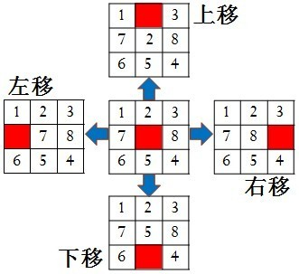
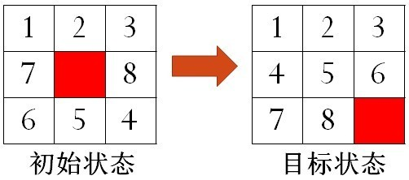
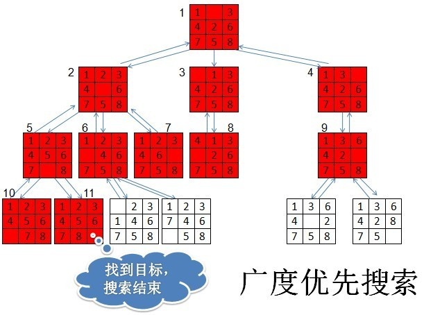
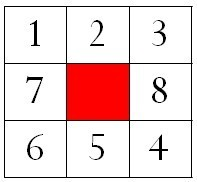
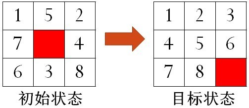

# N-Puzzle

* TOC
{:toc}

----------

## 一、实验简介

### 1.1 重排拼图游戏（N-数码问题）
以3\*3拼图（8-数码问题）为例，在3\*3的方格棋盘上，放置8个标有1、2、3、4、5、6、7、8数字的方块和1个空白格，空白格可以上下左右移动。要求通过反复移动空白格，寻找一条从某初始状态到目标状态的移动路径，如图1所示。

重排拼图游戏也叫N-数码问题(N-puzzle,N=M\*M-1)，高维数码问题（如15数码、24数码）常常被用来作为一些搜索算法的测试实例。本实验需要用到软装置[Jiasaw](./resources/jigsaw_code.zip)。

图1 八数码问题（红色块表示空白格）

### 1.2 实验目的
通过完成重排拼图游戏，加深对搜索策略的理解和应用：
 1. 学会利用**广度优先搜索**算法求得指定8-数码问题（3\*3拼图）的最优解；
 2. 学会利用**启发式搜索**算法求解随机生成的24-数码问题（5\*5拼图）。

----------

## 二、搜索策略介绍

### 2.1 盲目搜索策略
用于搜索的方法可分为两大类：盲目搜索和启发式搜索。深度优先搜索(Depth-First-Search)和广度优先搜索(Breadth-First-Search)是常见的盲目搜索方法，它们在搜索节点时都采用固定的排序，没有考虑问题领域可应用的知识，也称为无信息引导的搜索策略。

在走迷宫题目中，我们介绍了深度优先搜索算法，这里我们介绍另一种盲目搜索算法------广度优先搜索。

#### 2.1.1 BFS基本思想
从图中某节点V出发，在访问了V之后依次访问V的各个未曾访问过的邻接点，然后分别从这些邻接点出发依次访问它们的邻接点，并使"先被访问的节点的邻接点"先于"后被访问的节点的邻接点"被访问，直至图中所有已被访问的节点的邻接点都被访问到。如果还存在未被发现的节点，则选择其中一个作为源节点并重复以上过程。图2是一个广度优先搜索算法的示意图。

BFS总是尽可能"广"地搜索每一个节点的邻接点，能够找到从源结点到目标结点的最短路径，因而本实验采用它来求8-数码问题的最优解。

图2 广度优先搜索(BFS)算法示意图（拼图状态旁边的序号代表访问顺序）

#### 2.1.2 BFS算法步骤

 1. 将起始节点放入一个open列表中。
 2. 如果open列表为空，则搜索失败，问题无解；否则重复以下步骤：

    a. 访问open列表中的第一个节点v，若v为目标节点，则搜索成功，退出。

    b. 从open列表中删除节点v，放入close列表中。

    c. 将所有与v邻接且未曾被访问的节点放入open列表中。

### 2.2 启发式搜索

#### 2.1.1 基本思想
与盲目搜索不同，启发式搜索（如A\*算法）利用问题拥有的启发信息来引导搜索，动态地确定搜索节点的排序，以达到减少搜索范围，降低问题复杂度的目的。

在N-数码问题中，每搜索到每一个节点时，通过"估价函数"对该节点进行"评估"，然后优先访问"最优良"节点的邻接节点，能够大大减少求解的时间。

#### 2.1.2 估价函数
估价函数f(n)用来估计节点n的重要性，表示为：从起始节点，经过节点n，到达目标节点的代价。f(n)越小，表示节点n越优良，应该优先访问它的邻接节点。可参考的估价方法有：
 1. 所有 放错位的数码 个数
 2. 所有 放错位的数码与其正确位置的距离 之和
 3. 后续节点不正确的数码个数
 4. ......

可以同时使用多个估价方法，`f(n) = a*f1(n) + b*f2(n) + ... ` 通过适当调整权重(`a,b,...`)，能够加快搜索速度。

#### 2.1.3 算法步骤

 1. 将起始节点放入一个列表中。
 2. 如果列表为空，则搜索失败，问题无解；否则重复以下步骤：

    a. 访问列表中的第一个节点v，若v为目标节点，则搜索成功，退出。

    b. 从列表中删除节点v。

    c. 利用估价函数，对所有与v邻接且未曾被发现的节点进行估价，按照估价大小（小的在前）插入列表中。

----------

## 三、实验软装置介绍
在本实验中，拼图被抽象为一个数据结构------`JigsawNode`类，求解拼图的过程则在`Jigsaw`类和`Solution`类中完成。要求在`Solution`类中实现搜索算法，运行`Runner*`演示脚本熟悉拼图任务（N-数码问题），最终在`main`测试脚本中评判求解结果。

| 属性 | 介绍 |
| :----: | :----: |
| `JigsawNode` | 拼图的数据结构 |
| `Jigsaw` | 搜索算法基类 |
| `Solution` | 实现`Jigsaw`抽象方法 |
| `Runners*` | 演示脚本 |
| `main` | 测试脚本 |

### 3.1 拼图的数据结构
JigsawNode类描述了拼图的数据结构，包括两个重要元素："节点状态"和"节点操作"。5.1节有JigsawNode类的详细文档。

 1. 节点状态（以3\*3拼图为例）
    
    每一拼图状态称为一个节点状态，由一个10元数组nodesState表示。例如，图4的状态表示为｛5，1，2，3，7，0，8，6，5，4｝。其中，第1位代表空白格所处位置，其余9位分别代表每一格中所放方块的数值（按照先行后列排序）。

    

    图3 某一节点状态（红色块表示空白格）

 2. 节点操作

    重排拼图游戏的操作过程，在实验中表示为对节点状态的操作，由以下四个类方法实现。如果空白格处于边缘位置，则可能无法向某些方向移动，返回false。

    | 方法 | 作用 | 返回值 |
    | :----: | :----: | :----: |
    | `public boolean moveEmptyUp()` | 空白格向上移 | 成功返回true 失败返回flase |
    | `public boolean moveEmptyDown()` | 空白格向下移 | 成功返回true 失败返回flase |
    | `public boolean moveEmptyLeft()` | 空白格向左移 | 成功返回true 失败返回flase |
    | `public boolean moveEmptyRight()` | 空白格向右移 | 成功返回true 失败返回flase |

### 3.2 代码说明
本实验的软装置与GridWorld没有关联，这里包含三个类：`JigsawNode`类、`Jigsaw`类、`Solution`类(继承`Jigsaw`)，以及三个演示脚本和一个评分脚本。第五部分(API)有代码的详细说明文档。

`JigsawNode`类是拼图的数据结构，包含节点状态和节点操作这两个重要的元素，在3.1节已作介绍，5.1节有详细说明。

`Jigsaw`类则是完成搜索的地方，其中存储了拼图的初始状态、目标状态以及当前状态，以及与拼图游戏相关的其他数据和方法。演示脚本RunnerDemo.java使用了`ASearch(JigsawNode bNode, JigsawNode eNode)`求解随机8-数码问题（3\*3拼图）；实验任务一要求在`Solution`类的`BFSearch(JigsawNode bNode, JigsawNode eNode)`中修改广度优先搜索算法；实验任务二要求修改`estimateValue(JigsawNode jNode)`方法，完成用启发式搜索求解24-数码问题（5\*5拼图）。

Runners目录中包含了1个基本的演示脚本和2个实验任务演示脚本。

`main`脚本评判求解效率。

----------

## 四、实验任务

### 4.1 演示程序
（Demo）运行演示脚本`RunnerDemo.java`，求解随机8数码问题（3\*3拼图）。参照2.2节，阅读Jigsaw类中的`ASearch(JigsawNode bNode, JigsawNode eNode)`和`estimateValue(JigsawNode jNode)`方法。熟悉`JigsawNode`类和`Jigsaw`类。

### 4.2 实验任务一
利用广度优先搜索求出指定N-数码问题的最优解。

如图4所示，指定初始状态为

    {5,1,5,2,7,0,4,6,3,8}
目标状态为

    {9,1,2,3,4,5,6,7,8,0}

图4 指定的8-数码问题

`RunnerPart1.java`演示脚本对应以上8-数码例子。但在评判脚本`main.java`中测试的是24-数码。

要求参照2.1节，在`Solution`类中修改广度优先搜索算法`BFSearch(JigsawNode bNode, JigsawNode eNode)`求得最优解，即是从初始状态到达目标状态的步数最少的移动路径。

具体要求：
 1. 只能修改`Solution`类中的`BFSearch(JigsawNode bNode, JigsawNode eNode)`函数，可在`Solution`类添加其他函数，属性。**其余代码不能更改，否则可能导致评测时编译或运行失败**
 2. 要求求解成功后：
    - 能通过`getPath()`方法得到解路径

注意：所有可能的节点状态为25!/2种，因而采用广度优先搜索求解随机初始状态的5\*5拼图可能需要花费较长时间，所以保证在最终测例的最短路径长度不超过11。

### 4.3 实验任务二
（5分）利用启发式搜索求解随机生成的24-数码问题（5\*5拼图）

参照2.3节，修改`Solution`类中的代价估计函数`estimateValue(JigsawNode jNode)`，对随机生成的5\*5拼图初始状态进行求解。

具体要求：
 1. 只能修改`Solution`类中的`estimateValue(JigsawNode jNode)`函数，可在`Solution`类中添加其他函数，属性。**其余代码不能更改，否则可能导致评测时编译或运行失败**
 2. 要求访问节点总数不超过**29000**个

----------

## 五、Application Programming Interface（API）

### 5.1 JigsawNode类

| 属性 | 介绍 |
| :----: | :----: |
| `int dimension` | 拼图维数：若为N\*N拼图游戏，则dimension=N |
| `int[] nodesState` | 节点状态：长度为N\*N+1。其中第1位代表空白格所处位置，其余N\*N位分别代表每一格中所放方块的数值（按照先行后列排序） |
| `int nodeDepth` | 节点深度：从初始节点到该节点所用的步数 |
| `JigsawNode parent` | 父节点：到达此节点的上一节点，用于获取解路径 |
| `int estimatedValue` | 代价估值：记录该节点的代价估值 |

| 方法 | 介绍 |
| :----: | :----: |
| `JigsawNode(int[] data)` | 构造函数，参数为表示节点状态的数组。其中第1位代表空白格所处位置，其余N\*N位分别代表每一格中所放方块的数值（按照先行后列排序） |
| `JigsawNode(JigsawNode j)` | 构造函数，参数为一个状态节点 |
| `int getDimension()` | 获取N\*N拼图的维数N |
| `int[] getNodesState()` | 获取代表状态节点的数组 |
| `void setNodeDepth(int d)` | 设置节点深度 |
| `int getNodeDepth()` | 获取节点深度 |
| `void setParent(JigsawNode parent)` | 设置父节点 |
| `JigsawNode getParent()` | 获取父节点 |
| `void setEstimatedValue(int e)` | 设置代价估值 |
| `int getEstimatedValue()` | 获取代价估值 |
| `public void setInitial()` | 初始化节点的代价估值estimatedValue、节点深度nodeDepth和父节点parent。用与打散拼图操作scatter之后 |
| `public boolean isValid()` | 判断节点是否有效 |
| `public int[] canMove()` | 探测当前状态中空白格的可移动方位。返回一个四位数组，1到4位分别代表空白格是否能向上、下、左、右移动。值为1可移动，值为0不可移动 |
| `boolean canMoveEmptyUp()` | 判断该状态节点的空白格能否向上移动。若可以则返回true，否则返回false |
| `boolean canMoveEmptyDown()` | 判断该状态节点的空白格能否向下移动。若可以则返回true，否则返回false |
| `boolean canMoveEmptyLeft()` | 判断该状态节点的空白格能否向左移动。若可以则返回true，否则返回false |
| `boolean canMoveEmptyRight()` | 判断该状态节点的空白格能否向右移动。若可以则返回true，否则返回false |
| `public boolean move(int direction)` | 向某一方向移动当前拼图状态中的空白格。参数direction代表移动方向：0为向上，1为向下，2为向左，3为向右。移动成功返回true，失败返回false |
| `boolean moveEmptyUp()` | 向上移动该状态节点中的空白格, 成功返回true,失败返回false |
| `boolean moveEmptyDown()` | 向下移动该状态节点中的空白格, 成功返回true,失败返回false |
| `boolean moveEmptyLeft()` | 向左移动该状态节点中的空白格, 成功返回true,失败返回false |
| `boolean moveEmptyRight()` | 向右移动该状态节点中的空白格, 成功返回true,失败返回false |

### 5.2 Jigsaw类

| 属性 | 介绍 |
| :----: | :----: |
| `JigsawNode beginJNode` | 拼图的起始状态节点 |
| `JigsawNode endJNode` | 拼图的目标状态节点 |
| `JigsawNode currentJNode` | 拼图的当前状态节点 |
| `Vector<JigsawNode> solutionPath` | 解路径 ：用以保存从起始状态到达目标状态的移动路径中的每一个状态节点 |
| `int searchedNodesNum` | 已访问节点数： 用以记录所有访问过的节点的数量 |
| `Queue<JigsawNode> exploreList` | 用以保存已发现但未访问的节点 |
| `Set<JigsawNode> visitedList` |  用以保存已发现的节点 |

| 方法 | 介绍 |
| :----: | :----: |
| `public Jigsaw(JigsawNode bNode, JigsawNode eNode)` | 拼图构造函数，bNode-初始状态节点，eNode-目标状态节点 |
| `public static JigsawNode scatter(JigsawNode jNode, int len)` | 此函数用于打散拼图：将输入的初始状态节点jNode随机移动len步，返回其打散后的状态节点 |
| `public static boolean isValidPath(Vector<JigsawNode> solutionPath, JigsawNode startNode, JigsawNode destNode)` | 测试路径是否有效 |
| `public JigsawNode getCurrentJNode()` | 获取拼图的当前状态节点 |
| `public void setBeginJNode(JigsawNode jNode)` | 设置拼图的初始状态节点 |
| `public JigsawNode getBeginJNode()` | 获取拼图的初始状态节点 |
| `public void setEndJNode(JigsawNode jNode)` | 设置拼图的目标状态节点 |
| `public JigsawNode getEndJNode()` | 获取拼图的目标状态节点 |
| `public boolean isCompleted()` | 获取拼图的求解状态 |
| `public void reset()` | 重置拼图的求解状态 |
| `public String getSolutionPath()` | 获取解路径文本。解路径solutionPath的字符串，若有解，则分行记录从初始状态到达目标状态的移动路径中的每一个状态节点；若未解或无解，则返回提示信息。 |
| `public Vector<JigsawNode> getPath` | 获取解路径 |
| `public int getSearchedNodesNum()` | 获取访问过的节点数searchedNodesNum |
| `public void printResult(PrintWriter pw)` | 将搜索结果写入文件中，同时显示在控制台 |
| `public void prune()` | 清空已发现但未访问的节点 |
| `public boolean prune(Predicate<JigsawNode> filter)` | 有选择地删除某些已发现但未访问的节点 |
| `public boolean ASearch(JigsawNode bNode, JigsawNode eNode)` | 启发式搜索 |
| `public abstract BFSearch(JigsawNode bNode, JigsawNode eNode)` | 抽象函数，广度优先搜索算法 |
| `private abstract void estimateValue(JigsawNode jNode)` | 抽象函数，计算并修改节点的代价估值estimatedValue |

### 5.3 Solution类

| 方法 | 介绍 |
| :----: | :----: |
| `public Solution(JigsawNode bNode, JigsawNode eNode)` | 拼图构造函数，bNode-初始状态节点，eNode-目标状态节点 |
| *演示及实验任务函数* | *演示及实验任务函数* |
| `public BFSearch(JigsawNode bNode, JigsawNode eNode)` | 广度优先搜索算法，求解指定N-数码问题的最优解 |
| `public void estimateValue(JigsawNode jNode)` | 计算并修改节点的代价估值 |

### 5.4 演示脚本Runners

| 脚本名 | 介绍 |
| :----: | :----: |
| RunnerDemo.java | **演示脚本**，使用启发式搜索求解随机8-数码问题（3\*3拼图）。参考Jigsaw类中的`ASearch(JigsawNode bNode, JigsawNode eNode)`和`estimageValue()`函数 |
| RunnerPart1.java | **实验一测试脚本**，使用广度优先算法求解指定8-数码问题（3\*3拼图）的最优解 |
| RunnerPart2.java | **实验二测试脚本**，使用启发式搜索算法求解随机24-数码问题（5\*5拼图） |

### 5.5 测试脚本main
简单读取测例进行结果评判。可无视。

| 属性 | 介绍 |
| :----: | :----: |
| `int ASTAR_TEST_TIME` | 启发式搜索测试次数 |
| `int BFS_SCORE` | 广度优先搜索的总分 |
| `int ASTAR_SCORE` | 启发式搜索的总分 |
| `JigsawNode DEST_NODE` | 所有测试用例的目标状态 |
| `int bfsLength` | 广度优先搜索的最短路径长度  |
| `JigsawNode bfsNode` | 广度优先搜索的测例 |
| `JigsawNode[] aStarNodes` | 启发式搜索的测例 |

| 方法 | 介绍 |
| :----: | :----: |
| `public static int calBFSScore(int length)` | 广度优先搜索分数计算公式 |
| `public static int calAStarScore(double searchedNodesNum)` | 启发式搜索分数计算公式 |
| `public static int TestBFS()` | 测试广度优先搜索 |
| `public static int TestAStar()` | 测试启发式搜索 |
| `public static int TestAStar(JigsawNode startNode, JigsawNode destNode)` | 单次测试启发式搜索 |

